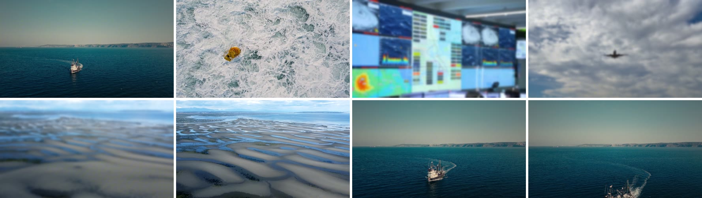
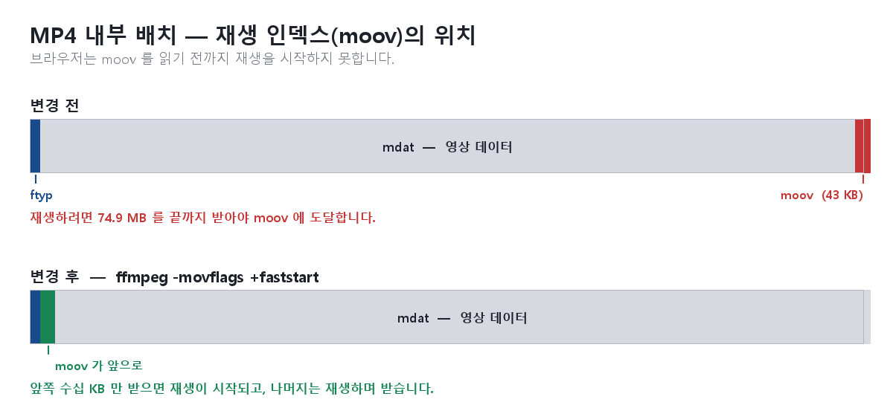
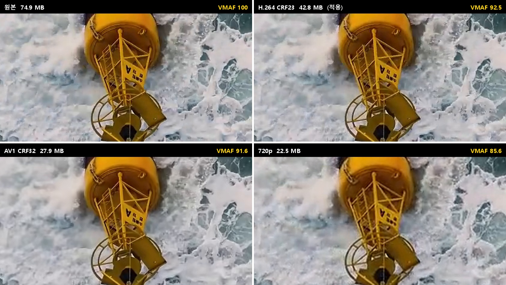
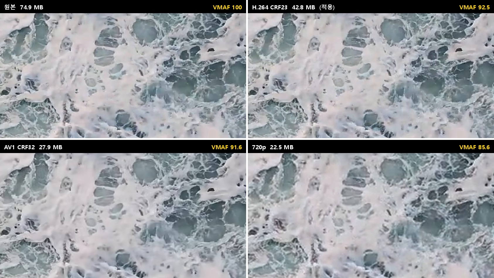

메인 화면에 64초짜리 배경 영상을 깔았습니다. 드론으로 찍은 선박, 부이, 갯벌, 관제실이 이어지는 1920×1080 영상입니다.



문제는 **처음 방문한 사람에게 이 영상이 보이지 않는다**는 것이었습니다. 로딩이 끝날 때까지 미리 깔아둔 그라디언트 배경만 보이다가, 한참 뒤에야 영상으로 바뀝니다.

출발점의 제약은 분명했습니다.

- **화질은 낮추고 싶지 않다.** 회사 첫인상을 만드는 화면입니다.
- **로딩 전 대체 배경이 아니라, 그냥 영상이 나왔으면 좋겠다.**

용량을 줄이면서 화질은 지켜야 한다는, 언뜻 모순처럼 보이는 요구였습니다.

## 첫 번째 헛다리 — 비트레이트를 낮춰본다

파일을 열어보니 이랬습니다.

```
1920×1080, 30fps, 64.04초
H.264 Main / Level 4.0
9.36 Mbps
AAC 오디오 트랙 포함
74.9 MB
```

배경 루프에 9.36Mbps는 과해 보였습니다. 게다가 `muted`로 재생하니 오디오 트랙은 통째로 낭비입니다. CRF 기반으로 다시 인코딩하면 화질을 유지한 채 크게 줄 것이라 기대했습니다.

```bash
ffmpeg -i hero.mp4 -an -c:v libx264 -crf 20 -preset slow \
  -pix_fmt yuv420p -movflags +faststart out.mp4
```

결과는 **62.7 MB**. 17% 줄었을 뿐입니다. 오디오를 통째로 뺐는데도 그 정도였습니다(오디오는 0.3MB밖에 되지 않았습니다).

이유는 영상 내용에 있었습니다. 아웃포커스 보케, 파도 거품, 잔물결 — 전부 고주파 노이즈 덩어리입니다. 압축기 입장에서 최악의 소재이고, 9Mbps는 낭비가 아니라 **실제로 필요한 값**이었습니다. 원본은 이미 효율적으로 인코딩되어 있었습니다.

용량이 문제라는 전제부터 다시 볼 필요가 있었습니다.

## 진짜 원인 — moov 가 파일 끝에 있었다

MP4 파일의 내부 구조를 열어봤습니다.

```
ftyp             32 bytes  at 0
free              8 bytes  at 32
mdat     74,860,220 bytes  at 40
moov         43,154 bytes  at 74,860,260
```

`moov`는 각 프레임이 파일 어디에 있는지 알려주는 **재생 인덱스**입니다. 브라우저는 이걸 읽기 전까지 재생을 시작할 수 없습니다. 그런데 이 파일은 `moov`가 맨 끝, 74,860,260 바이트 지점에 있었습니다.

즉 브라우저는 **74.9MB를 전부 받아야 비로소 첫 프레임을 그릴 수 있었습니다.**



이건 화질과 아무 관계가 없는 문제였습니다. 편집 프로그램에서 내보낼 때 흔히 이렇게 나오고, 고치는 방법은 플래그 하나입니다.

```bash
ffmpeg -i hero.mp4 -c:v copy -movflags +faststart out.mp4
```

`moov`를 앞으로 옮기면 앞쪽 수십 KB만 받아도 재생이 시작되고, 나머지는 재생하면서 받습니다. 스트림을 다시 인코딩하지 않으므로 **화질 손실이 0**입니다.

첫 요구였던 "화질을 낮추고 싶지 않다"는, 사실 이 한 줄로 대부분 해결되는 문제였습니다.

## 대체 배경 대신 첫 프레임을 깔다

두 번째 요구 — "로딩 전 다른 배경 말고 영상이 나왔으면" — 은 발상을 뒤집어 풀었습니다.

영상의 **첫 프레임을 그대로 뽑아 배경 이미지로 깝니다.**

```bash
ffmpeg -ss 0 -i hero.mp4 -frames:v 1 -update 1 \
  -c:v libwebp -quality 82 hero-poster.webp
```

마침 첫 프레임이 아웃포커스 보케라 WebP로 **14KB**밖에 되지 않았습니다.


14KB는 사실상 즉시 뜹니다. 그리고 이 이미지는 영상의 첫 프레임과 픽셀이 동일하므로, 보는 사람 입장에서는 **처음부터 영상이 멈춰 있다가 재생되는 것처럼** 보입니다. 그라디언트에서 영상으로 갈아타는 이질감이 사라집니다.

```astro
<!-- 영상 첫 프레임이라 로드 전/모션 최소화 설정에서도 영상이 멈춰 있는 것처럼 보인다. -->
<div class="fixed inset-0 -z-20 bg-cover bg-center"
     style={`background-image:url(${ heroPoster.src })`}></div>
```

`<video poster>` 속성만 쓰지 않고 별도 `<div>` 배경으로도 깐 데는 이유가 있습니다. `prefers-reduced-motion` 설정에서 영상을 `hidden` 처리하면 poster까지 같이 사라지기 때문입니다. `<div>`로 깔아두면 그 경우에도 정지 화면이 남습니다.

## 코덱을 바꿔본다 — AV1

로딩 문제는 풀렸지만, 9.36Mbps를 계속 스트리밍해야 하는 부담은 남아 있었습니다. 느린 회선에서는 재생 중에 끊길 수 있습니다.

그래서 코덱을 비교했습니다. 화질 판단을 눈대중에 맡기지 않으려고 **VMAF**로 측정했습니다. 100이 원본과 동일한 값입니다.

12초 구간을 잘라 측정한 결과는 이랬습니다.

| 후보 | VMAF |
|---|---|
| H.264 CRF23 | 96.96 |
| AV1 CRF32 | 96.94 |
| H.264 CRF26 | 95.02 |
| AV1 CRF38 | 95.84 |

AV1 CRF32가 H.264 CRF23과 **같은 화질에 용량은 절반**이었습니다. 선택은 분명해 보였습니다.

```bash
ffmpeg -i hero.mp4 -an -c:v libsvtav1 -crf 32 -preset 5 \
  -g 120 -pix_fmt yuv420p -movflags +faststart hero-av1.mp4
```

**27.9 MB.** 원본 대비 63% 감소. 여기서 끝난 줄 알았습니다.

## 그런데 끊겼다

적용해보니 재생이 눈에 띄게 끊겼습니다. 로딩은 빨라졌는데 재생이 매끄럽지 않았습니다.

가장 먼저 의심한 건 **프레임이 버려졌나**였습니다. 인코딩 과정에서 프레임을 떨어뜨렸다면 그렇게 보일 테니까요. 세어봤습니다.

```bash
ffprobe -select_streams v:0 -count_frames \
  -show_entries stream=r_frame_rate,nb_read_frames hero.mp4
```

```
원본 :  1921 frames, 30/1
AV1  :  1921 frames, 30/1
```

동일했습니다. 프레임은 하나도 버려지지 않았습니다. 원인이 다른 데 있다는 뜻입니다.

다음 의심은 **디코딩 부하**였습니다. AV1은 압축률이 높은 대신 디코딩이 무겁고, 하드웨어 디코더를 타지 못하면 CPU가 전부 감당합니다. 1080p AV1을 소프트웨어로 디코딩하는 건 만만치 않습니다.

그런데 장비를 확인해보니 이랬습니다.

```
GPU : NVIDIA GeForce RTX 3060 Ti  /  Intel UHD Graphics 770
CPU : 12th Gen Intel Core i9-12900K
```

두 GPU 모두 AV1 하드웨어 디코딩을 지원하고, CPU도 충분히 강력합니다. 그럼에도 끊겼다는 건, **GPU가 지원한다고 해서 브라우저가 실제로 그 경로를 탄다는 보장은 없다**는 뜻이었습니다. 드라이버, 브라우저 빌드, 합성 경로 중 하나만 어긋나도 소프트웨어 디코딩으로 떨어집니다.

이 지점에서 방향을 되돌렸습니다.

## H.264 로 돌아가되, 얻은 것은 지킨다

AV1이 준 이점은 용량이었고, 대가는 디코딩 부하였습니다. 그런데 **로딩 문제의 진짜 해법은 faststart였지 AV1이 아니었습니다.** AV1을 포기해도 잃는 건 용량 일부뿐입니다.

H.264로 돌아가되 faststart는 유지했습니다.

여기서 한 가지를 더 발견했습니다. 재인코딩한 파일의 스펙을 보니 이랬습니다.

```
원본        : H.264 Main / Level 4.0
재인코딩본  : H.264 High / Level 5.0
```

**원본은 Level 4.0이었는데, 제가 재인코딩하면서 5.0으로 올려놓은 것이었습니다.** x264가 비트레이트와 버퍼를 넉넉히 잡으면서 자동으로 올린 값입니다. 오래된 하드웨어 디코더는 Level 5.0 스트림을 거부하고 소프트웨어 디코딩으로 떨어지므로, 구형 환경에서는 이것만으로도 끊김의 원인이 될 수 있습니다.

명시적으로 눌렀습니다.

```bash
ffmpeg -i hero-original.mp4 -an -c:v libx264 -crf 23 -preset slow \
  -profile:v high -level:v 4.0 -maxrate 12M -bufsize 24M \
  -pix_fmt yuv420p -movflags +faststart hero.mp4
```

화질 손실 없이 Level만 낮추는 것이라 순수한 이득입니다.

## 샘플 구간 측정의 함정

최종본을 확정하면서 VMAF를 **전체 64초**로 다시 측정했습니다. 앞서 12초 구간에서 96~97이 나왔던 값들이 이렇게 바뀌었습니다.

| 파일 | 용량 | VMAF (12초 구간) | VMAF (전체) |
|---|---|---|---|
| 원본 | 74.9 MB | 100 | 100 |
| H.264 CRF20 | 62.7 MB | — | 95.02 |
| **H.264 CRF23 (적용)** | **42.8 MB** | 96.96 | **92.47** |
| AV1 CRF28 | 37.8 MB | 97.45 | 93.11 |
| AV1 CRF32 | 27.9 MB | 96.94 | 91.56 |
| 720p | 22.5 MB | — | 85.58 |

**4점 이상 벌어졌습니다.** 처음 고른 12초 구간에 파도·포말 같은 어려운 장면이 적었기 때문입니다. 장면 난이도가 고르지 않은 영상에서 샘플 구간만 재고 판단하면 화질을 실제보다 후하게 평가하게 됩니다.

중간에 파도 구간만 따로 잘라 측정했을 때는 더 심한 실수를 했습니다. `-c copy`로 자르면 키프레임 경계에 맞춰 잘리기 때문에 원본 클립이 271프레임, 인코딩본이 241프레임이 되어 프레임 정렬이 어긋난 채로 비교되고 있었습니다. 그렇게 나온 숫자는 아무 의미가 없습니다. **VMAF는 두 영상의 프레임이 정확히 대응할 때만 유효합니다.**

실제 픽셀도 확인했습니다. 영상에서 디테일이 가장 풍부한 부이 클로즈업(13초, 390번 프레임)을 2배로 확대한 것입니다. 앞선 실수를 반복하지 않도록 네 파일 모두 프레임 번호를 지정해 뽑았습니다.

```bash
ffmpeg -i input.mp4 -vf "select='eq(n\,390)'" -fps_mode passthrough -frames:v 1 -update 1 out.png
```



노란 격자와 사다리, 표면의 작은 글씨까지 남아 있습니다. 원본과 적용본은 거의 구분되지 않고, AV1에서 얇은 프레임이 조금 흐려지며, 720p에서 글씨가 뭉개지기 시작합니다. **피사체의 형태는 끝까지 살아남습니다.**

먼저 무너지는 쪽은 미세 텍스처입니다. 같은 프레임의 거품 영역입니다.



거품 구멍의 가장자리와 잔거품이 단계적으로 뭉개집니다. 잃는 것은 형태가 아니라 **표면의 질감**입니다.

VMAF 92.5는 이렇게 2배로 확대해 나란히 놓고 봐야 차이가 감지되는 수준이고, 실제로는 화면 전체를 덮은 채 30fps로 움직이며 그 위에 텍스트까지 얹힙니다.

## 오래된 환경까지

마지막 요구는 "옛날 컴퓨터나 크롬 버전에서도 돌았으면"이었습니다.

이 시점에서 AV1은 완전히 배제됩니다. AV1은 Chrome 70 이상, Safari 17 이상에서만 재생되므로 구형 지원이 목표라면 방향이 정반대입니다. H.264 High/Level 4.0은 2010년 이후 사실상 모든 기기에서 하드웨어 디코딩됩니다.

여기에 720p 버전을 더했습니다. 오래된 기기는 코덱을 지원해도 1080p 디코딩 자체가 버겁기 때문입니다.

```astro
<video class="fixed inset-0 -z-10 size-full object-cover motion-reduce:hidden"
       poster={heroPoster.src} autoplay muted loop playsinline preload="auto">
  <!-- media 를 모르는 구형 브라우저는 첫 source 를 쓴다 — 그쪽에 가벼운 720p 가 오도록 순서를 잡았다. -->
  <source src={hero720} type="video/mp4" media="(max-width: 768px)" />
  <source src={hero1080} type="video/mp4" />
</video>
```

`media` 속성의 순서가 핵심입니다.

- 모바일·작은 화면 → 720p
- **`media`를 해석하지 못하는 구형 브라우저 → 첫 번째인 720p** (디코딩이 가벼워 오히려 유리)
- 현대 데스크탑 → 1080p

구형일수록 자동으로 가벼운 쪽을 집게 되는 순서라, 별도 분기 코드 없이 목적이 달성됩니다.

결과적으로 폴백이 세 겹으로 쌓였습니다. **poster(14KB) → 720p(22.5MB) → 1080p(42.8MB).** 코덱을 지원하지 않든, 자동재생이 막혔든, 네트워크가 느리든, 최소한 정지 화면은 항상 보입니다.

## 검토했지만 채택하지 않은 것

작은 파일을 먼저 재생하다가 고화질이 다 받아지면 갈아 끼우는 방식도 검토했습니다. 결론은 **이 경우엔 이득이 없다**였습니다.

- 총 다운로드가 27.9MB + 74.9MB로 **늘어납니다.** 원래 목표와 정반대입니다.
- 먼저 보여줄 그 파일이 끊기던 AV1입니다. 문제를 초반에 재현하는 셈입니다.
- poster가 이미 같은 역할을 훨씬 싸게 합니다. 14KB이고 첫 프레임과 픽셀이 동일합니다.
- 두 영상의 재생 위치를 프레임 단위로 맞춰야 하고, 전환 순간의 깜빡임을 없애기 어렵습니다.

이 기법이 값어치를 하는 건 영상이 몇 분 이상이라 끝까지 받는 것을 기대할 수 없을 때입니다. 64초짜리 루프는 faststart만 걸면 앞부분부터 재생되면서 나머지를 받으므로, 두 벌을 받을 이유가 없습니다.

## 정리

| 항목 | 변경 전 | 변경 후 |
|---|---|---|
| 재생 시작 조건 | 74.9MB 전부 수신 | 앞쪽 수십 KB |
| 데스크탑 | 74.9 MB | 42.8 MB |
| 모바일·구형 | 74.9 MB | 22.5 MB |
| 로딩 중 화면 | 그라디언트 | 영상 첫 프레임 (14KB) |
| 프로파일 | Main / L4.0 | High / L4.0 |
| 오디오 | AAC 포함 | 제거 (muted 라 불필요) |

돌아보면 배운 것은 세 가지입니다.

**증상에서 원인을 곧바로 추측하지 않는 것.** "영상이 늦게 뜬다"는 증상은 용량을 가리키는 것처럼 보였지만, 실제 원인은 `moov` 위치였습니다. 파일을 열어보기 전까지는 알 수 없었고, 용량만 줄이는 접근으로는 끝까지 해결되지 않았을 문제입니다.

**최신 기술이 항상 정답은 아니라는 것.** AV1은 지표상 명백한 승자였지만 실제 재생 환경에서 끊겼습니다. 벤치마크의 승자와 사용자 환경의 승자는 다를 수 있습니다.

**측정을 의심하는 것.** 12초 샘플은 4점을 후하게 줬고, 잘못 자른 클립은 아예 무의미한 숫자를 내놨습니다. 숫자가 나왔다고 해서 그 숫자가 옳다는 뜻은 아닙니다.

그리고 정작 가장 큰 효과를 낸 것은 `-movflags +faststart`, 플래그 하나였습니다.
